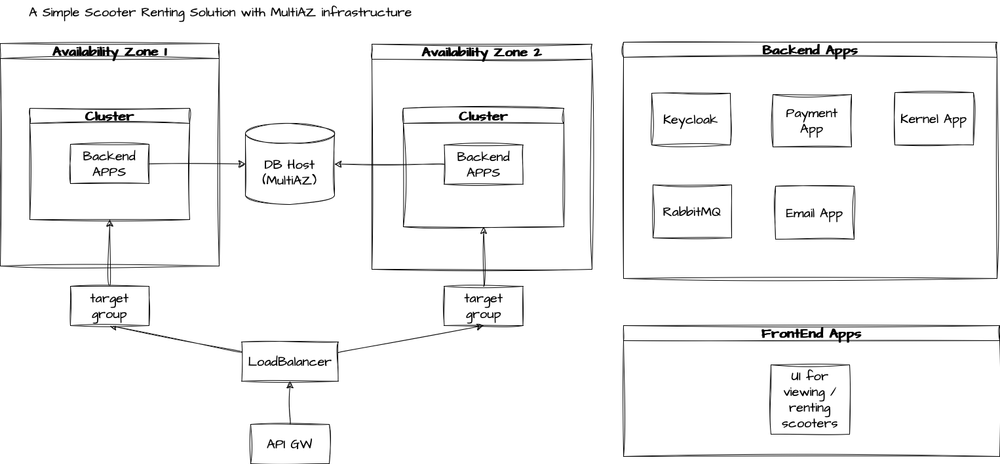
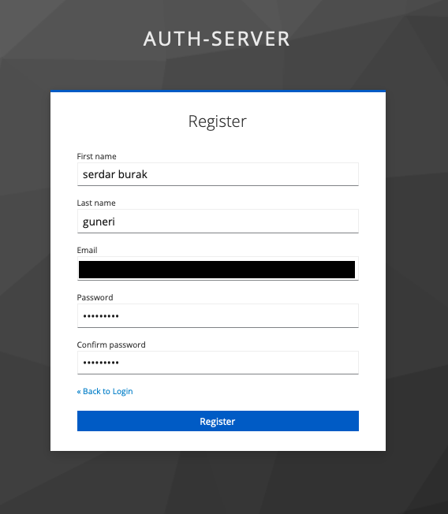
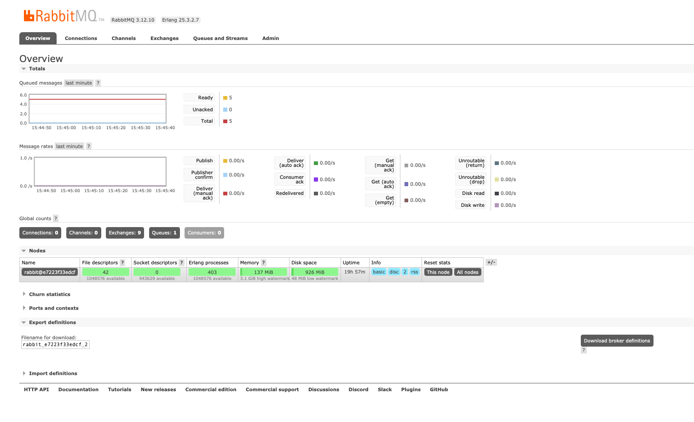

# general info

I am starting a hobby project that simulates a scooter renting service just for fun!

I want to create myself some distributed system problems and solve them by playing with rabbitMQ.

Each app have more information in their readme files.

The image below shows a high level architecture.

 


# starting the apps

There is a docker-compose.yml file under the scripts/docker-compose directory. I am thinking of 
having all necessary apps there to simulate the solution.

Simply, run

```
docker-compose build
```

and 
```
docker-compose up 
```

to have the services running. It will start a postgres, a keycloak and a rabbitmq instance for now. 
As I implement services, I will include them in the docker-compose.yml file.

# Keycloak

Keycloak is responsible for user journey such as signing in, signin up and creating JWTs. It's also responsible for
validating the tokens and authorising endpoints.

After "docker-compose up" you should have a keycloak running. 
* Simply, create a new realm and name it "auth-server".
* Change settings of the realm and enable user registration.
* By using the "account" client, you should be able to see login page. (This page is a perfect login page candidate for the UI)
* Create a new user. Later, we will use this user to create tokens etc. 



# RabbitMQ

RabbitMQ is used for managing the async communication between modules.

After "docker-compose up" you should have a rabbitMQ running.

* Visit the exposed port "15672" to ensure it's functioning well.



# Kernel

This is the main service responsible for registering, listing, unlocking and locking the scooters and managing the rental history. 

# IotServer

IOT server is responsible for communication with the scooters in the field. This is the service where I will simulate getting scooter information and send them some commands such as locking and unlocking etc.

# Email

Email service is responsible for listening to some RabbitMQ channels and sending informative emails to the customers.

# Payment

Payment service will simulate payments for rides. Pricing is also a part of this service, to keep the solution simple.

# Use cases

These are the things I am thinking of implementing:

* An admin can register a new scooter to the system.
* An admin can modify the scooter registered.
* A user can list all scooters. Each scooter has location information, so it would be nice to filter
scooters within a geographic area.
* A user can rent and unlock a scooter.
* A user can stop the ride and lock the scooter.
* Whenever a ride ends, the payment service handles the transaction.
* Whenever a ride starts and ends, IOT server tells the scooter to be available or not.
* Each scooter send info like battery level, location and current speed etc to the IOT server.
