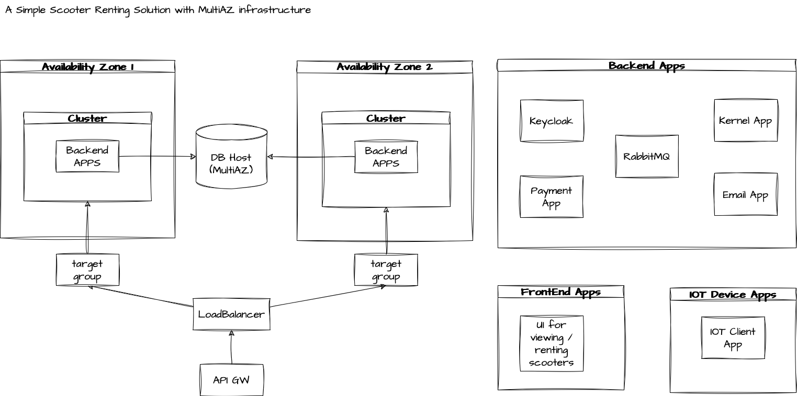

# General Info

I am starting a hobby project that simulates a scooter renting service just for fun!

I want to create myself some distributed system problems and solve them by playing with rabbitMQ.

Each app will have more information in their readme files. 

# Trying Rest Endpoints

OpenAPI documents can be found in the documentation folders of each app.
With swagger editor, it should be easy to understand how REST endpoints work.


# Architecture

The image below shows a high level architecture.

 


# Starting the apps

There is a docker-compose.yml file under the scripts/docker-compose directory. I am thinking of 
having all necessary apps there to simulate the solution.

Simply, run

```
docker-compose build
```

and 
```
docker-compose up 
```

to have the services running. It will start a postgres, a keycloak and a rabbitmq instance for now. 
As I implement services, I will include them in the docker-compose.yml file.

# Keycloak

Keycloak is responsible for user journey such as signing in, signin up and creating JWTs. It's also responsible for
validating the tokens and authorising endpoints.

After "docker-compose up" you should have a keycloak running. 
* Simply, create a new realm and name it "auth-server".
* Change settings of the realm and enable user registration.
* By using the "account" client, you should be able to see login page. (This page is a perfect login page candidate for the UI) (example: localhost:8180/realms/auth-server/protocol/openid-connect/auth?client_id=account-console)
* Create a new user. Later, we will use this user to create tokens etc.
* Create groups as "admins" and "users" and then create roles "ADMIN" and "USER" then assign these roles to the groups.
* Add your test user to the admin group so it can use the rest endpoints with ADMIN role.


* Crete a client, name it scooter-renting, enable client authentication and authorisation. Using the client id and client secret, a token can be generated.


To get a token for your user, simply run

```
curl -X POST \
'http://localhost:8180/realms/auth-server/protocol/openid-connect/token' \
-H 'Content-Type: application/x-www-form-urlencoded' \
-d 'grant_type=password&username=your_username&password=your_password&client_id=scooter-renting&client_secret=your_client_secret'
```

and you will receive a json like

```
{
"access_token": "",
"expires_in": 300,
"refresh_expires_in": 1800,
"refresh_token": "",
"token_type": "Bearer",
"id_token": "",
"not-before-policy": 0,
"session_state": "e52207db-66bb-414a-9191-44ac24b684a2",
"scope": "openid profile email"
}
```

Using the token as auth header will help using the API

```
curl --location 'http://localhost:8081/scooter' \
--header 'Authorization: Bearer eyJhbG...'
```

```
[
    {
        "id": "56ff36c1-b913-45f6-8fc3-d238569b6995",
        "serialNumber": "ABCDE1234",
        "brand": "Bird",
        "model": "One",
        "batteryLevel": 98.700,
        "location": {
            "latitude": "59.335444",
            "longitude": "18.063669"
        },
        "status": "AVAILABLE"
    }
]
```


# RabbitMQ

RabbitMQ is used for managing the async communication between modules.

After "docker-compose up" you should have a rabbitMQ running.

* Visit the exposed port "15672" to ensure it's functioning well.


# Kernel

This is the main service responsible for registering, listing, unlocking and locking the scooters and managing the rental history. 

# IotClient

IOT client represents the application to run in Scooters. I am thinking of having the communication with RabbitMQ 
so scooters should simply subscribe to the queue for commands and for sending their updates. 

# Email

Email service is responsible for listening to some RabbitMQ channels and sending informative emails to the customers.

# Payment

Payment service will simulate payments for rides. Pricing is also a part of this service, to keep the solution simple.

# Use cases

These are the things I am thinking of implementing:

* An admin can register a new scooter to the system.
* An admin can modify the scooter registered.
* A user can list all scooters. Each scooter has location information, so it would be nice to filter
scooters within a geographic area.
* A user should have card information to be able to unlock a scooter.
* A user can rent and unlock a scooter.
* A user can stop the ride and lock the scooter.
* Whenever a ride ends, the payment service handles the transaction.
* Whenever a ride starts and ends, IOT server tells the scooter to be available or not.
* Each scooter send info like battery level, location and current speed etc to the IOT server.
